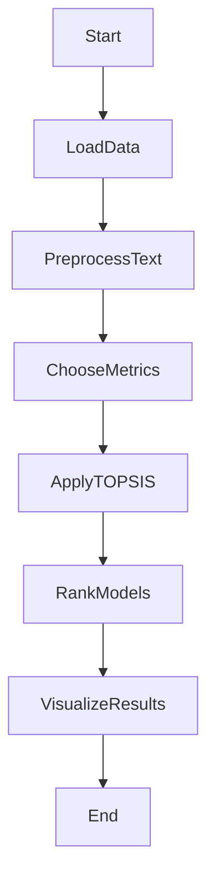

# -Pretrained-model-Comparison-for-Text-Summarization-using-Topsis



## Overview

Text summarization is a crucial natural language processing task that involves condensing large documents into concise and informative summaries. This project focuses on comparing the performance of various text summarization models to help users choose the most suitable model for their specific needs.

## Key Features:

1. **Metrics Considered:**
   - The comparison is based on essential metrics, including BLEU Score, Semantic Coherence, Factual Accuracy, and Content Coverage.
     
2. **Methodology - TOPSIS:**
   - The Technique for Order of Preference by Similarity to Ideal Solution (TOPSIS) method is employed for the comparison. This method considers both the similarity to the ideal solution and the dissimilarity to the negative ideal solution, providing a comprehensive ranking.

3. **Models Evaluated:**
   - Real-world pre-trained models, such as facebook/bart-large-cnn, t5-large, sshleifer/distilbart-cnn-12-6, google/pegasus-large and allenai/led-large-16384-arxiv, are included in the comparison. These models are widely used in text summarization tasks.

## Project Structure:

- **`train.csv`**: CSV file containing training data.
- **`evaluation_results.csv`**: CSV file containing evaluation metrics for each model.
- **`topsis_results.csv`**: CSV file with ranked results in tabular format.

## How to Run:

1. **Clone the Repository:**
   ```bash
   git clone https://github.com/yatharthgautam123/-Pretrained-model-Comparison-for-Text-Summarization-using-Topsis.git

## Results and Analysis:
1. **Evaluation Metrics Table:**
- Explore detailed ranked results in topsis_results.csv:

| **Model**                        | **BLEU Score**   | **Semantic Coherence**| **Factual Accuracy**| **Content Coverage** | **TOPSIS Score**  | **Rank**  |
|----------------------------------|------------------|-----------------------|---------------------|----------------------|-------------------|-----------|
| facebook/bart-large-cnn          |0.348812198315615 |0.655735972296425      |0.458348647372745    |0.371619325675868     |0.756144373364756  |3          |
| t5-large                         |0.339787619680929 |0.755253974199994      |0.457264601997934    |0.408908353539881     |0.815415414177986  |2          |
| sshleifer/distilbart-cnn-12-6    |0.305259455039259 |0.708327446474822      |0.521720904293639    |0.483918843036832     |0.865145990077243  |1          |
| google/pegasus-large             |0.361715316003006 |0.70710365712162       |0.420561581466909    |0.363004447339982     |0.726353658156676  |4          |
| allenai/led-large-16384-arxiv    |0.152972697190969 |0.243868179930235      |0.284098502397507    |0.186362323986993     |0                  |5          |


# MIT License

**Copyright (c) [2024] [Yatharth Gautam]**

Permission is hereby granted, free of charge, to any person obtaining a copy
of this software and associated documentation files (the "Software"), to deal
in the Software without restriction, including without limitation the rights
to use, copy, modify, merge, publish, distribute, sublicense, and/or sell
copies of the Software, and to permit persons to whom the Software is
furnished to do so, subject to the following conditions:

**The above copyright notice and this permission notice shall be included in all
copies or substantial portions of the Software.**

*THE SOFTWARE IS PROVIDED "AS IS", WITHOUT WARRANTY OF ANY KIND, EXPRESS OR
IMPLIED, INCLUDING BUT NOT LIMITED TO THE WARRANTIES OF MERCHANTABILITY,
FITNESS FOR A PARTICULAR PURPOSE AND NONINFRINGEMENT. IN NO EVENT SHALL THE
AUTHORS OR COPYRIGHT HOLDERS BE LIABLE FOR ANY CLAIM, DAMAGES OR OTHER
LIABILITY, WHETHER IN AN ACTION OF CONTRACT, TORT OR OTHERWISE, ARISING FROM,
OUT OF OR IN CONNECTION WITH THE SOFTWARE OR THE USE OR OTHER DEALINGS IN THE
SOFTWARE.*
IN CONNECTION WITH THE SOFTWARE OR THE USE OR OTHER DEALINGS IN THE
SOFTWARE.

